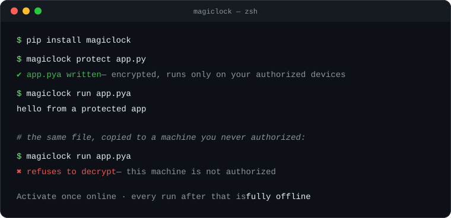

<div align="center">


# MagicLock — Python Source Code Encryption &amp; AI Model Protection

**Encrypt Python source code and AI models — they run only on the devices you authorize, fully offline.**

[Website](https://magiclock.net) · [Documentation](https://magiclock.net/docs) · [Pricing](https://magiclock.net/pricing) · [简体中文 README](README.zh-CN.md)


</div>

---

MagicLock is a commercial tool for **Python source code protection**, **AI model encryption**, and **software licensing**. One command turns your `.py` files and model weights into encrypted artifacts that still import and run like ordinary Python — but only on machines you authorize. Verification and decryption happen **fully offline**: no dongle, no license server for you to run, no network calls at run time.

<p align="center">
  
</p>

> This repository is the official home of MagicLock on GitHub: documentation pointers, runnable examples, and the public issue tracker. MagicLock itself is commercial, closed-source software — get it at [magiclock.net](https://magiclock.net).

## Why MagicLock for Python code protection

- **One command, zero code changes.** `magiclock protect app.py` encrypts your source. No decorators, no annotations, no build-system surgery — every protected module passes the runtime gate before a single line executes.
- **AI models decrypt in memory, nowhere else.** Weights are encrypted once, then sealed per authorized device. They unlock only at the moment of inference — never written to disk in plaintext, and no decryption secret ever leaves the device (no server can hand it over, including MagicLock's).
- **The license is the machine.** Activate once online; from then on every run passes a five-step gate locally — authenticity, validity, device fingerprint, entitlement, freshness — with **zero network connections**.
- **Two protection tiers.** The convenience tier (`.pya` encrypted artifacts) needs no compiler. The compiled tier (`magiclock build`) weaves a license gate into **every module** and compiles to native machine code — no plaintext Python ships, and no single check to find and patch out.
- **Two delivery promises, per artifact.** Default artifacts are **forever offline** — nothing can remotely stop them, ever. Opt-in `--web-gate` artifacts carry a **cloud kill switch**: flip a toggle in your portal and the app stops everywhere it is deployed, flip it back and it resumes — nothing to re-ship.
- **What you ship keeps working.** Your subscription gates *packaging new artifacts*, not decryption. Apps already delivered to your users keep running even after your subscription ends.
- **Agent-ready.** `magiclock skill` teaches any AI coding agent in your project — Claude Code included — to protect your code and models by itself.
- **Speaks your language.** CLI and portal in English, 简体中文, 繁體中文, 日本語, 한국어, Français.

## Quick start — encrypt Python code in two commands

```shell
pip install magiclock

# First run signs you in and activates this machine, then encrypts.
magiclock protect app.py     # -> app.pya  (encrypted artifact)
magiclock run app.pya        # runs exactly like `python app.py`

# Protect a whole project tree recursively:
magiclock protect src/
```

That's the entire workflow. `.pya` files are ordinary files — commit them, copy them, ship them however you already distribute your app. On any machine you haven't authorized, they decrypt to nothing.

## Encrypt AI models

```shell
magiclock protect-model models/face.onnx    # -> models/face.onnx.enc
```

```python
import magiclock
import onnxruntime

magiclock.bootstrap()                                        # gate up, against this machine's license
model_bytes = magiclock.open_model("models/face.onnx.enc")   # plaintext exists in memory only
session = onnxruntime.InferenceSession(model_bytes)
```

`open_model()` doesn't care what's in the envelope — ONNX, PyTorch state dicts, raw weights, datasets, config bundles. Bytes in, bytes out, never on disk.

## Compile Python to a native binary — the strongest tier

```shell
pip install "magiclock[build]"

magiclock build app.py                       # single native module (.so / .pyd)
magiclock build app.py --standalone          # self-contained app directory
magiclock build app.py --model weights.onnx  # bundle encrypted models into the build
```

`magiclock build` walks every `.py` module reachable from your entry point, inserts a license-gate check into each one, then compiles the result to native code. The output **needs no MagicLock install, no account, and no network** on the machine that runs it.

## Expiry, trials, and stronger locks

```shell
magiclock protect app.py --expires-in 30d       # artifact stops decrypting in 30 days
magiclock protect app.py --expires-at 2026-12-31
magiclock protect app.py --trial                # 48-hour self-destruct — for demos
magiclock protect app.py --lock-passphrase      # machine + passphrase two-factor lock
magiclock protect app.py --no-bind-machine --emit-key   # portable: unlocked by key, not machine
```

## Remotely disable shipped software — the cloud kill switch (`--web-gate`)

```shell
magiclock protect app.py --web-gate
```

A cloud-controlled artifact checks for your approval before it runs. Flip the switch off in your portal and it stops at its next check — everywhere it is deployed. Flip it back on and it resumes. Offline it keeps running through a grace window **you** choose (1 hour to 30 days). Built for rentals, subscriptions, expiring pilots, and unpaid invoices.

Artifacts built *without* the flag stay forever offline and can never be remotely revoked. The choice is per artifact, not per account — mix both in one product line.

## MagicLock vs PyArmor, SOURCEdefender, Nuitka, Cython &amp; PyInstaller

| | **MagicLock** | Obfuscators (e.g. PyArmor) | Encrypt-loaders (e.g. SOURCEdefender) | Compilers (Nuitka, Cython) | Packagers (PyInstaller) |
|---|---|---|---|---|---|
| Approach | Encryption + device-bound licensing + optional native compile | Bytecode obfuscation | AES-encrypted `.py` loading | Compile to C / native | Bundle into an executable |
| Code changes required | **None** | Usually none | None | None | None |
| Device-bound (node-locked) licensing | **Built in** | Varies by edition | — | — | — |
| AI model / asset encryption | **Built in, per-device envelopes** | — | — | — | — |
| Runs fully offline after activation | **Yes** | Varies | Varies | n/a (no licensing) | n/a (no licensing) |
| Remote kill switch (opt-in) | **Yes** | — | — | — | — |
| Time-limited / self-destructing artifacts | **Yes** | Varies | Yes | — | — |
| Localized CLI &amp; portal | **6 languages built in** — EN · 简体中文 · 繁體中文 · 日本語 · 한국어 · FR | Varies | — | — | — |
| Protection level ceiling | Native machine code with a gate in **every** module | Obfuscated bytecode (recoverable in principle) | Decrypted to bytecode at load | Native code, but **no licensing layer** | Archive is trivially unpacked |

Compilers and packagers solve distribution, not protection or licensing; obfuscation can be reversed with enough effort. MagicLock combines encryption, node-locked licensing, and native compilation in one tool — and adds the things none of the above have: per-device model encryption and a remote kill switch.

### MagicLock vs PyArmor

PyArmor is the best-known Python **obfuscator**: it transforms your scripts into obfuscated bytecode, with machine binding available in its paid editions. Obfuscation still hands the complete program to whoever holds the file — with enough effort it can be reconstructed. MagicLock **encrypts** instead: on an unauthorized machine there is nothing to reverse, only ciphertext. MagicLock also covers what obfuscation can't — per-device AI model encryption and an opt-in remote kill switch — and its compiled tier ships native machine code with a license gate woven into every module.

### MagicLock vs SOURCEdefender

SOURCEdefender AES-encrypts `.py` files and decrypts them at import time, with optional time-limited scripts. It answers "can someone read my source?" but not "who is allowed to run it?" — there is no device binding, no model encryption, and no way to act after shipping. MagicLock adds node-locked licensing (artifacts refuse to decrypt on machines you haven't authorized), per-device AI model envelopes, a compiled native tier, and the opt-in cloud kill switch.

### MagicLock vs Nuitka / Cython

Nuitka and Cython **compile** Python to C and native code — excellent for performance and a real obstacle to casual reading, but they are not licensing tools: the binary runs for anyone who has it, forever, and bundled assets like model weights ship in plaintext next to it. MagicLock's compiled tier builds on native compilation too, then adds what compilers leave out: a license gate in every module, device binding, encrypted models, and expiry.

### MagicLock vs PyInstaller

PyInstaller solves **packaging**, not protection: it bundles your app and interpreter into one executable, but the archive is trivially unpacked back to `.pyc` bytecode with freely available tools — it was never designed to keep secrets. MagicLock artifacts stay encrypted wherever the files travel, and only become a running program on devices you authorize. The two compose fine: protect with MagicLock, package however you like.

## FAQ

**Do I need to be online to run protected apps?**
No. Activation is online once; after that, protected code and models verify and decrypt fully offline on the authorized machine.

**What happens when my subscription ends?**
Everything you already shipped keeps working — the subscription only gates packaging *new* artifacts, not decryption. Renew when you want to publish again.

**Can I remotely stop an app I've already shipped?**
Yes, if you opted in when protecting it: `--web-gate` artifacts answer to a switch in your portal. Artifacts built without the flag are forever offline and can never be remotely revoked — that promise is absolute in both directions.

**Do my end users need a MagicLock account?**
No. You ship the protected app any way you like; your users need no account and no install (the compiled tier needs no MagicLock package at all on their machine).

**Does my source code or model ever get uploaded?**
No. `protect`, `protect-model`, and `build` run locally. Models decrypt only in memory on the authorized device, and the decryption secret never leaves it — it is never uploaded or escrowed, and no server can hand it over.

**Is the free trial really free?**
Yes — every capability, free for 48 hours on one device, no card. The clock starts when you first activate a machine, not at sign-up. When it ends, everything you built keeps working; you just can't package new artifacts until you subscribe.

**Which Python versions and platforms are supported?**
Python 3.9–3.14 on macOS (Apple Silicon), Windows, and Linux.

**How is this different from obfuscation?**
Obfuscation transforms code but still hands the whole program to the attacker. MagicLock encrypts — on an unauthorized machine there is nothing to reverse, just ciphertext. The compiled tier goes further: native machine code with a license gate woven into every module.

## Links

- 🌐 Website: **[magiclock.net](https://magiclock.net)**
- 📚 Documentation: **[magiclock.net/docs](https://magiclock.net/docs)**
- 💰 Pricing (48 h free trial, subscriptions, Lifetime): **[magiclock.net/pricing](https://magiclock.net/pricing)**
- 🐛 Bugs & questions: [open an issue](../../issues) right here

## License

The documentation and example code in **this repository** are MIT-licensed (see [LICENSE](LICENSE)). MagicLock itself is commercial, proprietary software — see [magiclock.net/pricing](https://magiclock.net/pricing).
